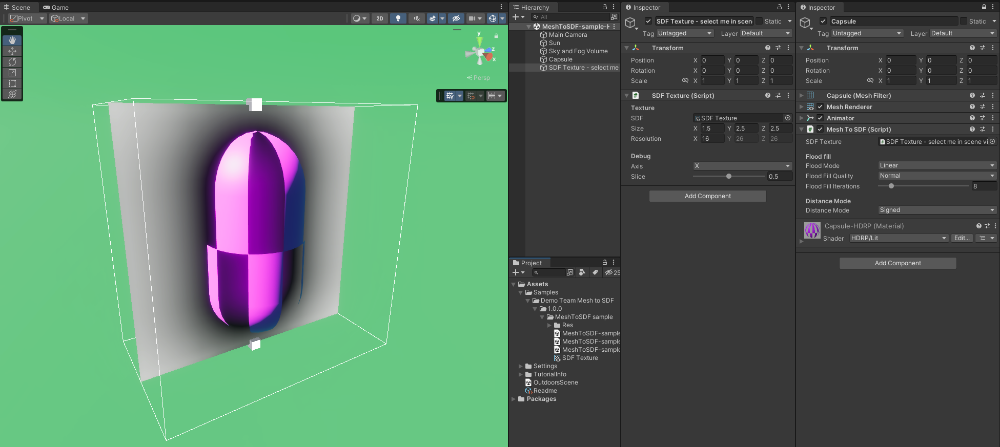
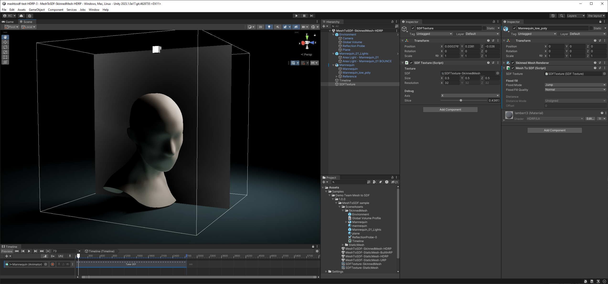
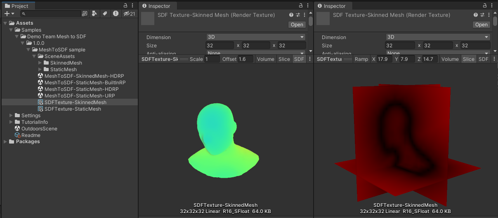
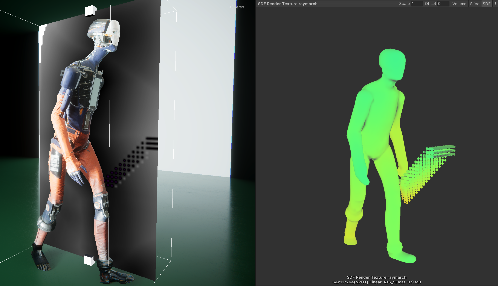

# Mesh-to-SDF Documentation

## Quickstart

Once the package has been imported:
1. Create an empty game object and give it an SDFTexture component.
2. This component and the game object's transform control the volume you will capture, so make sure it's place over your mesh and adjust the Size property.
3. Create a RenderTexture asset and assign it to the SDFTexture component.
4. Add a MeshToSDF component to your SkinnedMeshRenderer or MeshRenderer, and give it the previously created SDFTexture.
5. If you now select the SDFTexture object, you should see a slice of the SDF in the Scene View, dynamically updating.

Scripts can query `SDFTexture.sdf` and `SDFTexture.worldToSDFTexCoords` to get the texture and a texture coordinates transform to sample the texture.

Alternatively you can use the SDFTexture component as a way to place in the scene a static SDF 3DTexture generated elsewhere. Just assign the 3DTexture in the SDFTexture component.

### Sample

The setup described above is used in the samples included in the package. Samples can be imported into the project by navigating to the package in the Package Manager window and using the _Import_ button under _Samples_. The Samples folder that now should appear in the project contains scenes demonstrating usage both for static meshes (MeshFilter/MeshRenderer) and skinned meshes (SkinnedMeshRenderer). Setup in both cases is identical, though.

Look for the MeshToSDF component (type *t:MeshToSDF* in the Hierarchy search bar). MeshToSDF is the component responsible for generating an SDF for whatever mesh it finds on the same game object - be it a static mesh in a MeshFilter, or a skinned mesh in a SkinnedMeshRenderer.

The MeshToSDF component references an SDFTexture component. SDFTexture is responsible for placing an SDF in the space (through its Transform), and definiting its bounds (through the _Size_ property).

SDFTexture can also use a static, externally generated 3D texture containing an SDF. In that case MeshToSDF wouldn't be needed, and SDFTexture would just be useful for placing the SDF in the space, and exposing that placement, its matrix, etc. through its API.

In the sample SDFTexture references a 3D render texture, which allows MeshToSDF to dynamically write an SDF into it.

The SDF can be previewed either by selecting the SDFTexture game object while in Scene View, or by selecting the 3D render texture asset and using one of the built-in 3D texture preview modes in the Inspector.

\

## Limitations and known issues

- MacOS/Metal - there's a known bug causing occasional garbage output, and the SDF visualisation causing artifacts in other Editor windows.
- One MeshToSDF per SDF - no support yet for multiple MeshToSDF instances writing to the same SDF render texture.
- Vertex shader animation - vertex shader animation is not supported. However any kind of vertex animation affecting vertex buffers, including GPU skinning, is supported for meshes from SkinnedMeshRenderers.
- One submesh - for meshes with multiple submeshes, only the first submesh will be used.
- In signed mode occasionally a voxel near the surface will have its sign flipped (still correct absolute distance). The following flooding step unfortunately propagates that flip, causing artifacts like in the image. Unfortunately post-filtering is not a viable fix, since the flipped clusters can be larger than a single voxel. To limit the occurence of this issue, avoid pointy features on meshes, or switch to unsigned mode. 
