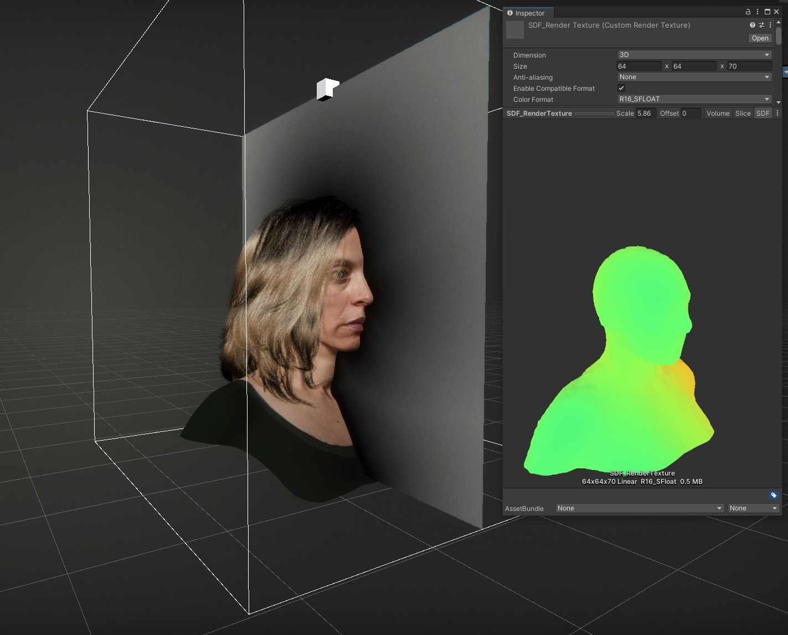

# Package: com.unity.demoteam.mesh-to-sdf

A real-time Signed Distance Field generator. Use a Mesh or a dynamically deforming SkinnedMesh as input to generate a 3D SDF texture every frame.

The SDF can be used by the VFX Graph, the Hair system, and other effects relying on SDFs.

\


The generator is real-time - to achieve better performance, it sacrifices robustness and the ability to handle large meshes. Typical resolutions would be a 5-8k triangle mesh in a 16^3^-64^3^ voxel volume. If your mesh is much larger or messy (holes, spiky shapes, etc.), it's best to use a cleaner low-res proxy mesh instead. Note that the SDF generator shipping with the VFX Graph has a more robust handling of larger or messy meshes, but it's slower.

The generator works by first splatting distances into voxels in a small area around each triangle, then using either a linear flood or jump flood to fill the rest of the volume.

## Requirements

- Unity 2021.2+ (mesh buffer access in compute shaders)
- Compute shaders supported on target platform

## Installation

Use [*Add package from git URL*](https://docs.unity3d.com/Manual/upm-ui-giturl.html) (in the Package Manager): 

```https://github.com/Unity-Technologies/com.unity.demoteam.mesh-to-sdf.git```

or

Declare the package as a git dependency in `Packages/manifest.json`:

```
"dependencies": {
    "com.unity.demoteam.mesh-to-sdf": "https://github.com/Unity-Technologies/com.unity.demoteam.mesh-to-sdf.git",
    ...
}
```

## Documentation

[Quickstart](Documentation~/index.md)

## Known issues

- Garbage output in some cases on MacOS/Metal.

